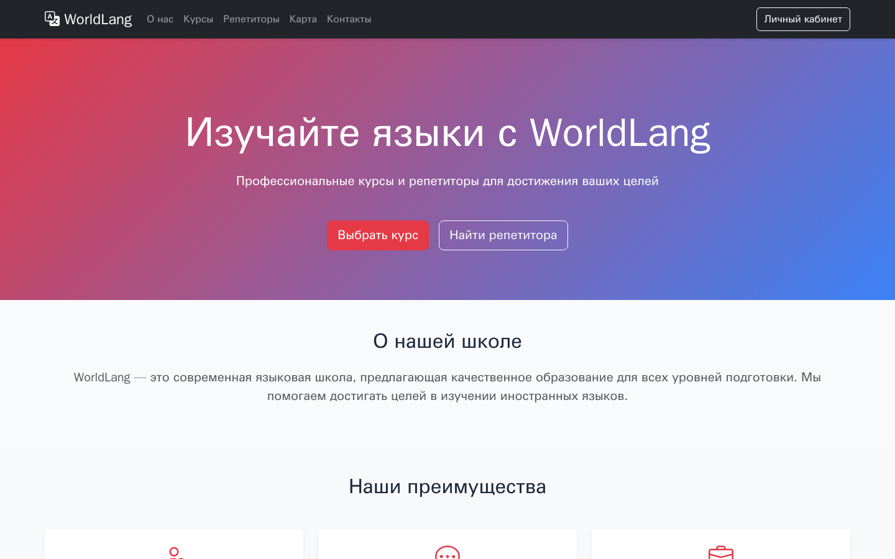

# WorldLang

[Русский](README.md) · **English**

Exam project for the "Web Technologies Basics" course: an online language school site with a course and
tutor catalog, applications, a personal account and a map of learning places, built on the course API.

**Status:** coursework (Moscow Polytech, group 241-327, exam, January 2026), completed, archived ·
site at [lang.deev.su](https://lang.deev.su) (the course API is not always available)

**Stack:** HTML5 · CSS3 · JavaScript (ES6+, fetch) · Bootstrap 5 · Yandex Maps API

- Course and tutor catalog with search, filters and pagination
- Application form with price calculation, date and time selection
- Personal account: view, edit and delete applications
- Map of learning places (Yandex Maps) with a list
- API data is escaped before insertion into the page (`esc()` in `js/utils.js`)

## Running

The site is static. On [lang.deev.su](https://lang.deev.su) nginx serves the files and proxies the course
API at `/api`. To run from disk, put the full API URL (given in a comment) into `js/api.js` and open
`index.html`.

Checks: `node --check js/*.js` and `npx htmlhint *.html` (rules in `.htmlhintrc`, also run by CI).

## License

Coursework (Web Technologies Basics, Moscow Polytechnic University, 2025/26). The code is open for study;
there is no separate license.

## Author

**Egor Deev** — [GitHub](https://github.com/EDeev) · [Telegram](https://t.me/DeevEgor) · [egor@deev.space](mailto:egor@deev.space)

---

  ⭐ If you find this project useful, give it a star on GitHub!
  
Made with ❤️ — <a href="https://deev.space">deev.space</a>

